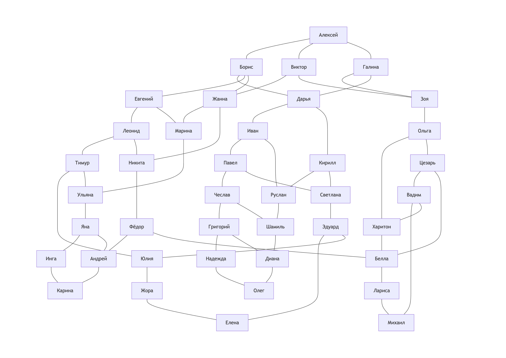

# 3HandsShake SHARK v 1.0 2025 made by Yan Batytskiy

### Задача
- сформировать пример графа для выполнения задания
- на основе сформированного графа социальных связей определенного круга людей, нужно найти все пары знакомств через три рукопожатия. Реализовать этот алгоритм на языке C++. 

### ⚠️ Схема графа

### Результат
Алексей and friends: Борис, Виктор, Галина, Дарья, Иван, Кирилл, Евгений, Леонид, Марина, Жанна, Никита, Зоя, Ольга 

Борис and friends: Алексей, Дарья, Евгений, Жанна, Виктор, Зоя, Галина, Иван, Павел, Руслан, Кирилл, Светлана, Леонид, Тимур, Никита, Марина, Ульяна, Фёдор 

Виктор and friends: Алексей, Борис, Дарья, Евгений, Жанна, Зоя, Галина, Марина, Ульяна, Никита, Фёдор, Леонид, Ольга, Харитон, Цезарь 

Галина and friends: Алексей, Борис, Дарья, Евгений, Жанна, Виктор, Зоя, Ольга, Харитон, Цезарь, Иван, Павел, Руслан, Кирилл, Светлана 

Дарья and friends: Борис, Алексей, Виктор, Галина, Иван, Кирилл, Евгений, Леонид, Марина, Жанна, Никита, Павел, Чеслав, Светлана, Руслан, Шамиль, Эдуард, Зоя, Ольга 

Евгений and friends: Борис, Алексей, Виктор, Галина, Дарья, Иван, Кирилл, Леонид, Марина, Жанна, Никита, Тимур, Юлия, Ульяна, Фёдор, Яна 

Жанна and friends: Виктор, Алексей, Борис, Галина, Марина, Никита, Зоя, Ольга, Ульяна, Яна, Тимур, Евгений, Леонид, Фёдор, Андрей, Белла, Дарья, Иван, Кирилл 

Зоя and friends: Галина, Алексей, Борис, Виктор, Ольга, Дарья, Иван, Кирилл, Харитон, Белла, Вадим, Цезарь, Жанна, Марина, Никита 

Иван and friends: Дарья, Борис, Алексей, Евгений, Жанна, Павел, Руслан, Кирилл, Светлана, Галина, Зоя, Чеслав, Григорий, Шамиль, Эдуард, Диана 

Кирилл and friends: Дарья, Борис, Алексей, Евгений, Жанна, Иван, Павел, Руслан, Светлана, Галина, Зоя, Шамиль, Диана, Чеслав, Эдуард, Елена, Юлия 

Леонид and friends: Евгений, Борис, Алексей, Дарья, Жанна, Тимур, Никита, Марина, Ульяна, Юлия, Жора, Эдуард, Яна, Виктор, Фёдор, Андрей, Белла 

Марина and friends: Жанна, Виктор, Алексей, Зоя, Ульяна, Евгений, Никита, Фёдор, Леонид, Борис, Дарья, Яна, Инга, Андрей, Тимур, Юлия 

Никита and friends: Жанна, Виктор, Алексей, Зоя, Марина, Ульяна, Евгений, Фёдор, Леонид, Борис, Дарья, Андрей, Карина, Яна, Белла, Харитон, Лариса, Цезарь, Тимур, Юлия 

Ольга and friends: Зоя, Галина, Алексей, Дарья, Харитон, Цезарь, Виктор, Жанна, Белла, Лариса, Фёдор, Вадим, Михаил 

Павел and friends: Иван, Дарья, Борис, Кирилл, Галина, Чеслав, Светлана, Руслан, Шамиль, Григорий, Надежда, Диана, Эдуард, Елена, Юлия 

Руслан and friends: Кирилл, Дарья, Борис, Иван, Галина, Шамиль, Светлана, Эдуард, Павел, Диана, Олег, Григорий, Чеслав 

Светлана and friends: Кирилл, Дарья, Борис, Иван, Галина, Руслан, Шамиль, Эдуард, Павел, Елена, Жора, Юлия, Тимур, Чеслав, Григорий 

Тимур and friends: Леонид, Евгений, Борис, Марина, Юлия, Ульяна, Никита, Жанна, Фёдор, Жора, Елена, Эдуард, Светлана, Яна, Инга, Андрей 

Ульяна and friends: Марина, Жанна, Виктор, Никита, Борис, Яна, Тимур, Евгений, Леонид, Инга, Карина, Андрей, Фёдор, Юлия, Жора, Эдуард 

Фёдор and friends: Никита, Жанна, Виктор, Марина, Борис, Андрей, Белла, Леонид, Евгений, Тимур, Карина, Инга, Яна, Ульяна, Харитон, Ольга, Вадим, Лариса, Михаил, Цезарь 

Харитон and friends: Ольга, Зоя, Галина, Виктор, Белла, Вадим, Цезарь, Лариса, Михаил, Фёдор, Никита, Андрей 

Цезарь and friends: Ольга, Зоя, Галина, Виктор, Харитон, Белла, Вадим, Михаил, Лариса, Фёдор, Никита, Андрей 

Чеслав and friends: Павел, Иван, Дарья, Руслан, Григорий, Шамиль, Светлана, Кирилл, Эдуард, Надежда, Олег, Диана 

Шамиль and friends: Руслан, Кирилл, Дарья, Светлана, Диана, Чеслав, Иван, Павел, Олег, Надежда, Григорий 

Эдуард and friends: Светлана, Кирилл, Дарья, Руслан, Елена, Юлия, Павел, Иван, Чеслав, Жора, Тимур, Леонид, Ульяна 

Юлия and friends: Тимур, Леонид, Евгений, Никита, Жора, Эдуард, Ульяна, Марина, Яна, Елена, Светлана, Кирилл, Павел 

Яна and friends: Ульяна, Марина, Жанна, Евгений, Инга, Андрей, Тимур, Леонид, Юлия, Карина, Фёдор, Никита, Белла 

Андрей and friends: Фёдор, Никита, Жанна, Леонид, Карина, Яна, Белла, Харитон, Лариса, Цезарь, Инга, Ульяна, Марина, Тимур 

Белла and friends: Харитон, Ольга, Зоя, Цезарь, Лариса, Фёдор, Вадим, Михаил, Никита, Жанна, Леонид, Андрей, Карина, Яна 

Вадим and friends: Цезарь, Ольга, Зоя, Харитон, Михаил, Белла, Лариса, Фёдор 

Григорий and friends: Чеслав, Павел, Иван, Светлана, Надежда, Диана, Шамиль, Руслан, Олег 

Диана and friends: Шамиль, Руслан, Кирилл, Иван, Олег, Григорий, Чеслав, Павел, Надежда 

Елена and friends: Эдуард, Светлана, Кирилл, Павел, Жора, Юлия, Тимур 

Жора and friends: Юлия, Тимур, Леонид, Ульяна, Елена, Эдуард, Светлана 

Инга and friends: Яна, Ульяна, Марина, Тимур, Карина, Андрей, Фёдор 

Карина and friends: Андрей, Фёдор, Никита, Белла, Инга, Яна, Ульяна 

Лариса and friends: Белла, Харитон, Ольга, Вадим, Михаил, Фёдор, Никита, Андрей, Цезарь 

Михаил and friends: Вадим, Цезарь, Ольга, Белла, Лариса, Харитон, Фёдор 

Надежда and friends: Григорий, Чеслав, Павел, Шамиль, Олег, Диана 

Олег and friends: Диана, Шамиль, Руслан, Чеслав, Надежда, Григорий 

## ⚙️ Требования

- C++17-совместимый компилятор (`g++`, `clang++`, `MSVC`)
- `CMake` версии **3.16+**
- (рекомендуется) `clangd` для автодополнения и анализа

## 📚 Лицензия

MIT License
